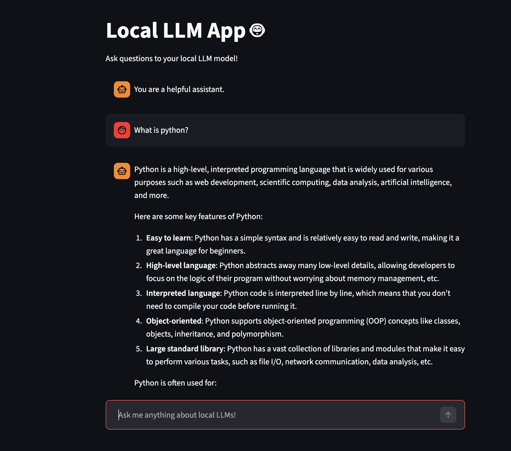

## 🧠 Building a Local LLM Application – High-Level Overview

This project follows a local-first approach to building an AI chatbot application, where all model execution happens on the developer’s machine. The objective is to ensure **data privacy, zero API dependency, and full control over AI workflows**.

---

## 🔧 Tools & Technologies Used

- **Python** – Core application language
- **Ollama** – Local LLM runtime for running open-source models
- **LLaMA 3.x (or similar models)** – Local large language model
- **Streamlit** – Lightweight web interface for chat interaction
- **Local System Resources** – CPU/GPU-based inference
- **Session Management** – Maintains conversation context

---

## 🔄 High-Level Workflow

1. **Local Environment Setup**  
   Prepare the system with Python and a local LLM runtime to run models offline.

2. **Model Installation**  
   Download and run open-source language models locally using Ollama.

3. **Application Interface**  
   Create a simple browser-based chat interface to interact with the model.

4. **Conversation Management**  
   Store user and assistant messages locally to maintain chat continuity.

5. **Model Interaction**  
   Send user prompts to the locally running LLM and receive generated responses.

6. **Streaming Responses**  
   Display responses gradually to improve user experience and realism.

7. **Local Execution**  
   Ensure all processing remains on the user’s machine without external API calls.

---

## 📸 Application Output

## 🎯 Key Benefits

- Full data privacy (no cloud dependency)
- No usage or API costs
- Offline AI capability
- Suitable for secure or confidential environments
- Ideal for experimentation and proof-of-concept development

---

## 📌 Use Cases

- Local AI chatbot experimentation
- Secure document analysis
- Internal knowledge assistants
- Learning and testing open-source LLM workflows

---

## 🚀 Future Enhancements

- Integration with document-based knowledge (RAG)
- Multi-model switching
- Performance optimization
- UI enhancements
- Deployment-ready architecture

---